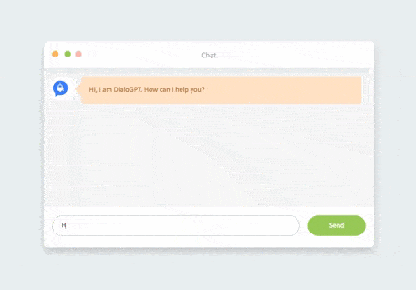

# Dockerized Chatbot using Kafka: 

<p align="center">
  

</p>

To run the project make sure you have a `docker` and `docker-compose` installed. 

You can clone the project and run : 

```bash
docker-compose up
```

The project architecture is structured as follow : 
- A frontend view connected to the Flask API via Websocket will send the message written by the user in the chat
- Flask API : The Flask API will send via a `Kafka-Producer` the message received via websocket to the  `Kafka topic` 
- Model : `Kafka-Consumer` will connecty to the `Kafka topic` and consumes the message. It will make the inference using  `Dialo-GPT` model provided by Huggingface. 
- Kafka zookeeper and broker : A dockerized version of zookeeper and a kafka broker instance will run simultaneously when running docker-compose. 
- You can access the chatbot app via browser on : `localhost:80`

**Notes :**
- You will need to check firewall setting to allow Websocket connections.
- Make sure the port 9092 is available for the kafka broker. 
- On the first start the app will take some time to download the pretrained model (~1.7 go), the webapp will be accessible as soon as the model is loaded.


